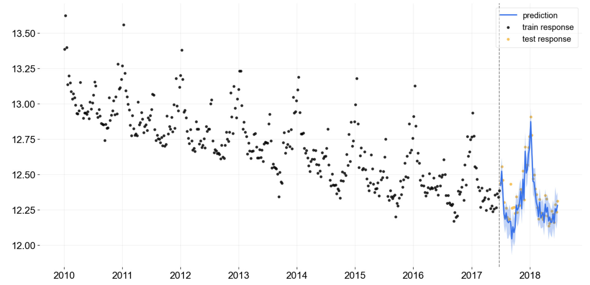

.. image:: docs/img/orbit-banner.png

-------------------------------------------

|pypi| |travis| |downloads|

Disclaimer
==========

This project

- is stable and being incubated for long-term support. It may contain new experimental code, for which APIs are subject to change.
- requires PyStan as a system dependency. PyStan is licensed under `GPLv3 <https://www.gnu.org/licenses/gpl-3.0.html>`__, which is a free, copyleft license for software.

Orbit: A Python package for Bayesian forecasting models
=======================================================

Orbit is a Python package for Bayesian forecasting models developed under object-oriented design. It provides a
familiar and intuitive initialize-fit-predict interface for working with
time series tasks, while utilizing probabilistic modeling api under
the hood.

The initial release supports concrete implementation for the following
models:

-  Local Global Trend (LGT)
-  Damped Local Trend (DLT)

Both models, which are variants of exponential smoothing, support
seasonality and exogenous (time-independent) features.

The initial release also supports the following sampling methods for
model estimation:

-  Markov-Chain Monte Carlo (MCMC) as a full sampling method
-  Maximum a Posteriori (MAP) as a point estimate method
-  Variational Inference (VI) as a hybrid-sampling method on approximate
   distribution

Installation
============
Prerequisites
-------------

Install from PyPi:

.. code:: bash

    pip install orbit-ml

Install from GitHub:

.. code:: bash

    git clone https://github.com/uber/orbit.git
    cd orbit
    pip install -r requirements.txt
    pip install .

Quick Start
===========
Load data
---------

.. code:: python

    import pandas as pd
    import numpy as np
    from orbit.utils.dataset import load_iclaims

    df = load_iclaims()
    df[['claims', 'trend.unemploy', 'trend.filling', 'trend.job']] =\
        df[['claims', 'trend.unemploy', 'trend.filling', 'trend.job']].apply(np.log)

    test_size=52
    train_df=df[:-test_size]
    test_df=df[-test_size:]

Damped-Local-Trend (DLT) Model with FULL Bayesian Prediction
------------------------------------------------------------

.. code:: python

    from orbit.models.dlt import DLTFull
    from orbit.diagnostics.plot import plot_predicted_data

    dlt = DLTFull(
        response_col='claims',
        date_col='week',
        regressor_col=['trend.unemploy', 'trend.filling', 'trend.job'],
        seasonality=52,
    )
    dlt.fit(df=train_df)

    # predicted df
    predicted_df = dlt.predict(df=test_df)

    # plot predictions
    plot_predicted_data(
        training_actual_df=train_df, predicted_df=predicted_df,
        date_col=dlt.date_col, actual_col=dlt.response_col,
        test_actual_df=test_df
    )

References
===========
Documentation
-------------

- `Orbit API Documentation and Examples <https://uber.github.io/orbit/>`__

Citation
--------

To cite Orbit in publications, refer to the following whitepaper:

`Orbit: Probabilistic Forecast with Exponential Smoothing <https://arxiv.org/abs/2004.08492>`__

Bibtex:

  @misc{ng2020orbit, title={Orbit: Probabilistic Forecast with Exponential Smoothing}, author={Edwin Ng, Zhishi Wang, Huigang Chen, Steve Yang, Slawek Smyl}, year={2020}, eprint={2004.08492}, archivePrefix={arXiv}, primaryClass={stat.CO}}

Papers
------

- Hyndman, R., Koehler, A. B., Ord, J. K., and Snyder, R. D. Forecasting with exponential smoothing: the state space approach. Springer Science & Business Media, 2008.

- Bingham, E., Chen, J. P., Jankowiak, M., Obermeyer, F., Pradhan, N., Karaletsos, T., Singh, R., Szerlip, P., Horsfall, P., and Goodman, N. D. Pyro: Deep universal probabilistic programming. The Journal of Machine Learning Research, 20(1):973–978, 2019.

- Taylor, S. J. and Letham, B. Forecasting at scale. The American Statistician, 72(1):37–45, 2018.

- Hoffman, M.D. and Gelman, A. The No-U-Turn sampler: adaptively setting path lengths in Hamiltonian Monte Carlo. J. Mach. Learn. Res., 15(1), pp.1593-1623, 2014.

Related projects
----------------

- `Pyro <https://github.com/pyro-ppl/pyro>`__
- `Stan <https://github.com/stan-dev/stan>`__
- `Rlgt <https://cran.r-project.org/web/packages/Rlgt/index.html>`__

.. |pypi| image:: https://badge.fury.io/py/orbit-ml.svg
    :target: https://badge.fury.io/py/orbit-ml
    :alt: pypi

.. |travis| image:: https://travis-ci.com/uber/orbit.svg?branch=master
 :target: https://travis-ci.com/uber/orbit
 :alt: travis

.. |downloads| image:: https://static.pepy.tech/personalized-badge/orbit-ml?period=total&units=international_system&left_color=blue&right_color=grey&left_text=Downloads
 :target: https://pepy.tech/project/orbit-ml
 :alt: downloads
